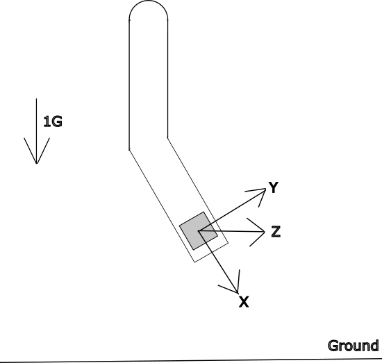

# Data Requirements
To ensure the output parameters for each domain is valid, ParaDigMa requires the input data to be of a specific format and structure. 

## General Data Structure
Irrespective of the sensor type, ParaDigMa requires a `pandas.DataFrame` object as input. The dataframe should contain the following columns:
* A column representing the time in seconds to start (first row equal to 0);
* If using accelerometer and/or gyroscope data, columns for each axis (x, y, and z);
* If using Photoplethysmography (PPG) data, a single column representing the light absorption. 

ParaDigMa expects the input to be a continuous segment and may present anomylous results if discontinuous segments are used as input. One can use the `create_segments` function of the toolbox to create continuous segments automatically. If all sensors are present, a dataframe sampled at 100 Hz may look as follows:

| time | accelerometer_x | accelerometer_y | accelometer_z | gyroscope_x | gyroscope_y | gyroscope_z | ppg |
|---|:---:|:---:|:---:|:---:|:---:|:---:|:---:|
| 0 | 0.683 | 0.428 | 0.843 | 3.583 | 5.383 | 4.837 | 84.536 | 
| 0.01 | 0.638 | 0.483 | 0.837 | 3.836 | 5.937 | 4.973 | 82.483 |
| ... | ... | ... | ... | ... | ... | ... | ... |
| 121.87 | -0.382 | 0.184 | -0.783 | 7.478 | 8.894 | -0.893 | 26.486 |

Note the following:
1. The different sensor modalities do not need to be sampled at the same frequency: the PPG signal is often collected at a lower sampling frequency than IMU data;
2. The sensor data does not need to be strictly uniformly sampled. ParaDigMa includes functionalities to account for slight variations in the sample-to-sample intervals, which is a known property of collected sensor data;
3. The column names can be set freely, and should be specified in the configuration when working with ParaDigMa (more on configurations **here**)

## Sensor orientation (IMU only)
When working with IMU data, it is important to consider the orientation of the axes of the sensors. For ParaDigMa, this is only directly relevant for the **gait** pipeline. There are three elements to consider:
1. What are the x, y, and z axis?
2. In which direction is each axis pointing, i.e., when is each axis positive or negative?
3. Is the smartwatch worn on the left or the right wrist?

#### What are the x, y, and z axis?
The orientation of the accelerometer sensor used for training the classifiers is displayed below. As can be observed, the x-axis represents the longitudinal/roll axis, the y-axis represents the vertical/pitch axis, and the z-axis represents the lateral/yaw axis. The direction of the gyroscope can be deducted using [Ampère's right-hand grip rule](https://en.wikipedia.org/wiki/Right-hand_rule#Amp%C3%A8re's_right-hand_grip_rule). 

#### In which direction is each axis pointing?
Regarding the direction, the x-axis is pointing toward the lower end of the arm, the y-axis updward, and the z-axis through the watch screen (if the watch is laid flat on the table, the z-axis points from above the table toward below the table). If the watch is held stable, and if the arrow indicating the direction of the axis is pointing in the same direction as the arrow representing gravity (1 G) in the figure, the sensor value should be negative (in fact, if held competely stable, the acceleration in this axis should be exactly equal to -1 G, or -9.81 m/s². More info on this phenomenon [here](https://en.wikipedia.org/wiki/Accelerometer)). Similarly, if it points in the opposite direction, the sensor value should be positive. 

#### Is the smartwatch worn on the left or the right wrist?
If the smartwatch is worn on the opposite wrist, the sign of the x-axis accelerometer, y-axis gyroscope and z-axis gyroscope flip. You can do this manually, or make use of the toolbox function `invert_axes`. 

## Units
ParaDigMa expects input data in the following units:
* Accelerometer: g
* Gyroscope: deg/s
* PPG: mV

You can align the units of your input data manually, or use the function `convert_units` of the toolbox.
