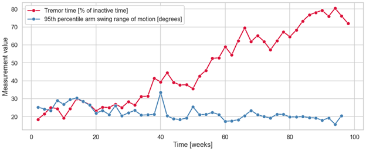

# Summary

ParaDigMa is an open-source Python package designed to extract digital biomarkers of Parkinson disease (PD) from wrist-worn sensor data collected during passive monitoring in daily life [@postParaDigMaToolboxDeriving2025a]. It processes raw accelerometer, gyroscope and photoplethysmography (PPG) signals using modular pipelines which address common challenges in real-world wearable sensor data analysis. The package currently targets three clinically relevant symptom domains: (1) tremor, (2) arm swing during gait, and (3) pulse rate (to derive digital biomarkers related to autonomic dysfunction). ParaDigMa enables researchers to derive interpretable and clinically meaningful digital biomarkers to monitor PD in daily life.

# Statement of need

The use of wearable sensors to monitor PD in daily life has grown exponentially over the past two decades [@debSystematicSurveyResearch2022], with mounting evidence supporting their utility for diagnosis, monitoring disease progression, and evaluating treatment efficacy [@sunDigitalBiomarkersPrecision2024]. However, the extraction of digital biomarkers from raw sensor signals often relies on proprietary or non-replicable pipelines applied to individual cohorts. To support their adoption in clinical and research practice, and to enable meaningful comparisons across studies, reproducible and standardized data processing workflows are essential [@sunDigitalBiomarkersPrecision2024; @boyleActivityBehavioralRecognition2025]. 

ParaDigMa addresses this need by providing pipelines for extracting digital biomarkers of PD from wrist-worn sensor data obtained from passive monitoring in daily life. Instead of requiring researchers to build end-to-end pipelines from scratch, ParaDigMa streamlines the transformation of raw wrist sensor data into clinically meaningful outcomes. In addition, its modular and standardized architecture enables users to replace or extend components, encouraging collaboration to expand and refine the toolbox for broader use in digital health research. 

# Comparison

While several toolboxes exist for analyzing wearable sensor data from individuals with PD, ParaDigMa distinguishes itself through its focus on passive monitoring in daily life using wrist-worn devices. 

Two comparable toolboxes are Mobgap [@kuderleMobGap2025] and GaitPy [@czechGaitPyOpenSourcePython2019a], tailored to gait analysis  using lower-back sensors. In contrast, ParaDigMa extracts digital biomarkers from wrist-worn sensors, enabling analysis of domains not adequately captured by lower-back sensors, such as tremor and reduced arm swing. An additional advantage of tailoring to wrist-worn devices is the high availability and unobtrusiveness of smartwatches, facilitating long-term monitoring in free-living conditions. Another key differentiator is ParaDigMa’s potential for cross-domain symptom analysis, crucial for the heterogeneous symptomatic manifestation and progression of PD [@maetzlerProgressionParkinsonsDisease2009]. This enables development of composite digital biomarkers—a step toward personalized progression monitoring [@adamsUsingSmartwatchSmartphone2023a]. A PD-specific toolbox covering multiple symptomatic domains is PDKit [@stamatePDKitDataScience2021], including modules for gait and tremor. It focuses on extracting features from sensor data obtained from active monitoring  (i.e., the analysis of brief, scripted tasks), where the execution of the activities is highly standardized. In contrast, ParaDigMa is tailored to passive, continuous monitoring in the person’s own home environment (were the precise nature of the actually performed activities is unknown) and includes functionalities to handle noisy, unscripted real-world sensor data. Furthermore, ParaDigMa requires one wrist-worn sensor to extract digital biomarkers of a variety of symptomatic domains, while PDKit uses different sensor placements per domain.

Beyond PD-specific toolboxes , ParaDigMa also differs from general-purpose toolboxes for processing wearable sensor data. For instance, HeartPy [@vangentHeartPyNovelHeart2019] enables users to derive insights related to pulse rate, but lacks PD-specific preprocessing, such as handling PPG motion artifacts in PD (for example introduced by tremor [@veldkampHeartRateMonitoring2025]). Another example is GGIR [@miguelesGGIRResearchCommunity2019], developed in R, which extracts generic activity metrics from accelerometer data collected during passive monitoring. However, this toolbox similarly does not contain PD-specific functionalities. A final example is mHealth [@snyderMhealthtoolsModularPackage2020], developed in R, which contains sensor position-agnostic functionalities but is limited to preprocessing and feature extraction. 

# Architecture

ParaDigMa is a Python toolbox for processing and analyzing wrist-worn sensor data. Its architecture, illustrated in Figure 1, is designed for flexibility and ease of use: each processing step is implemented as a standalone function, enabling users to run complete pipelines through a small number of sequential function calls. The toolbox supports data from inertial measurement units (IMUs) and/or photoplethysmography (PPG) sensors, and is device-agnostic, accepting input with minimal requirements (specified in its documentation). 

From top to bottom, data are processed as follows. First, raw sensor data are preprocessed through resampling, interpolation, and filtering (1. Preprocessing). The resulting time series are segmented into fixed-size windows, from which temporal and spectral features are extracted (2. Feature extraction). These features are then passed to domain-specific classifiers for the detection of relevant behavior (e.g., gait) or symptoms (e.g., tremor) (3. Classification). These predictions are combined with the preprocessed data to quantify the detected behavior (e.g., arm swing range of motion during gait) or symptoms (e.g., tremor power) (4. Quantification). The last step (5. Aggregation) contains functionalities to aggregate the output from steps 3 and 4 across relevant time scales to derive digital biomarkers (e.g., weekly typical tremor power).

This sequential, modular approach enables users to extract the output after each processing step. For example, users can examine the presence of tremor, the quantity of gait with or without other arm activities, and the PPG signal quality after classification (step 3). Furthermore, after quantification (step 4), users can examine daily fluctuations in tremor power (estimated per 4 seconds), arm swing range of motion (estimated per 1.5 seconds), and pulse rate (estimated per 2 seconds). Or, to study disease progression, users can assess week-to-week longitudinal changes in tremor time, typical and maximum tremor power, typical and maximum arm swing range of motion, or resting and maximum pulse rate after aggregation (step 5).

The ParaDigMa pipelines have been developed and validated using representative data from the Parkinson@Home Validation Study [@eversRealLifeGaitPerformance2020b] and the Personalized Parkinson Project (PPP) [@bloemPersonalizedParkinsonProject2019a]. The cross-sectional validity of all three pipelines has been demonstrated in recent scientific publications [@postQuantifyingArmSwing2025a; @timmermansGeneralizableOpensourceAlgorithm2025a; @veldkampHeartRateMonitoring2025]. Ongoing work is focused on longitudinal validation of the pipelines, including assessments of test-retest reliability and sensitivity to disease progression.

To facilitate standardization and reproducibility, ParaDigMa includes optional functionality for working with Time Series Data Format (TSDF) [@kokTsdf2024]. TSDF provides a consistent and efficient format for storing and reading time series data along with relevant metadata, such as data source and temporal coverage. This makes it easier to document, cache, and reuse intermediate outputs across pipeline stages, and to maintain interoperability across studies or devices.

# Application

Driven by the need for more sensitive biomarkers of therapeutical efficacy and disease progression, the use of wearable sensors in the context of clinical trials is rapidly increasing [@masanneckEvidenceClinicalTrialsgovGrowth2023], providing numerous opportunities for the application of ParaDigMa. Currently, ParaDigMa is being used in multiple clinical trials to derive exploratory endpoints, including the Slow-SPEED trial [@radbouduniversitymedicalcenterSlowSPEEDNLSlowingParkinsons2025], which evaluates the effects of an exercise intervention, and the Orchestra trial, which investigates the effects of an alpha-synuclein misfolding inhibitor on PD progression [@ucbbiopharmasrlDoubleBlindPlaceboControlledRandomized2024]. In addition, ParaDigMa is being applied in large cohort studies to better understand the heterogeneity of PD progression, including the PPP [@bloemPersonalizedParkinsonProject2019a] and Parkinson’s Progression Markers Initiative (PPMI) [@marekParkinsonProgressionMarker2011a] cohort studies.

# References